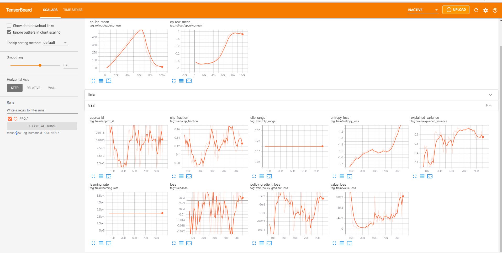

# Humanoid_Gym (Still working)
A humanoid learns to find its goal using reinforcement learning in a Unity3D simulation. The environment is being created using mlagents, where the goal of the humanoid is to reach its target goal. It employts four steps reward functions and uses 3D raycast perception to observe the environment. 


###  1. Requirements
------------

You need Python 3.6 or later to run the simulation. (Note: the current environment is only supported in windows) Also, you can directly interact with the simulation by clicking the Humanoid.exe file and then by using W,A and D keys.


[Install Unity-Gym](https://github.com/Unity-Technologies/ml-agents/tree/main/gym-unity)
[Install Stable-Baselines3](https://stable-baselines3.readthedocs.io/en/master/guide/install.html)

mlagents can be installed using pip:

    $ python3 -m pip install mlagents
    
### 2. (Training) You can train the environment by using the code below which has OpenAI gym structure. It will save the training results into a log directory which you can view using tensorboard. Feel free to change the parameters inside the code

```python
from stable_baselines3 import PPO, SAC
from mlagents_envs.side_channel.engine_configuration_channel import EngineConfigurationChannel
channel = EngineConfigurationChannel()
from gym_unity.envs import UnityToGymWrapper
from mlagents_envs.environment import UnityEnvironment
import time,os
from stable_baselines3.common.vec_env import DummyVecEnv
from stable_baselines3.common.monitor import Monitor
from stable_baselines3.common.policies import ActorCriticPolicy

env_name = "./Humanoid.exe"

env = UnityEnvironment(env_name,seed=1, side_channels=[channel])
channel.set_configuration_parameters(time_scale = 0.4)
env= UnityToGymWrapper(env, uint8_visual=False) # OpenAI gym interface created using UNITY

time_int = int(time.time())

# Diretories for storing results 
log_dir = "stable_results/humanoid_env_{}/".format(time_int)
log_dirTF = "stable_results/tensorflow_log_humanoid{}/".format(time_int) 
os.makedirs(log_dir, exist_ok=True)

env = Monitor(env, log_dir, allow_early_resets=True)
env = DummyVecEnv([lambda: env])  # The algorithms require a vectorized environment to run

model = PPO(ActorCriticPolicy, env, verbose=1, tensorboard_log=log_dirTF, device='cuda')


model.learn(int(100000)) # you can change the step size

time_int2 = int(time.time())

print('TIME TAKEN for training',time_int-time_int2)

# save the model
model.save("PPO_unity_humanoid")

# del model
model = PPO.load("PPO_unity_humanoid")
# evaluate_policy()

# mean_reward, std_reward = evaluate_policy(model, model.get_env(),n_eval_episodes=10)

obs= env.reset()

# Test the agent for 1000 steps after training
for i in range(1000):
    action, states = model.predict(obs)
    obs, rewards, done, info = env.step(action)
    env.render()

```

To monitor the training progress using tensorboard you type the following command from the terminal

    $ tensorboard --logdir "HERE PUT THE PATH TO THE DIRECTORY"
 
 If the training goes well you should be able to see the following graphs using tensorboard
 
 
 
 
### 3. (Testing) The following code can be used to test the trained Humanoid Agent
```python
from stable_baselines3 import PPO, SAC
from stable_baselines3.common.evaluation import evaluate_policy
from mlagents_envs.side_channel.engine_configuration_channel import EngineConfigurationChannel
channel = EngineConfigurationChannel()
from gym_unity.envs import UnityToGymWrapper
from mlagents_envs.environment import UnityEnvironment
import time,os
from stable_baselines3.common.vec_env import DummyVecEnv
from stable_baselines3.common.results_plotter import load_results, ts2xy
from stable_baselines3.common.noise import NormalActionNoise
from stable_baselines3.common.callbacks import BaseCallback 
from stable_baselines3.common.monitor import Monitor
from stable_baselines3.ppo import MlpPolicy
from stable_baselines3 import A2C
from stable_baselines3.common.policies import ActorCriticPolicy

env_name = "./Humanoid.exe"

env = UnityEnvironment(env_name,seed=1, side_channels=[channel])
channel.set_configuration_parameters(time_scale = 0.4)
# env= UnityToGymWrapper(env, uint8_visual=True)
env= UnityToGymWrapper(env, uint8_visual=False)

env = DummyVecEnv([lambda: env])  # The algorithms require a vectorized environment to run


model = PPO.load("PPO_unity_humanoid120")
# evaluate_policy()

# mean_reward, std_reward = evaluate_policy(model, model.get_env(),n_eval_episodes=10)

obs= env.reset()

for i in range(1000):
    action, states = model.predict(obs)
    obs, rewards, done, info = env.step(action)
    env.render()

```


